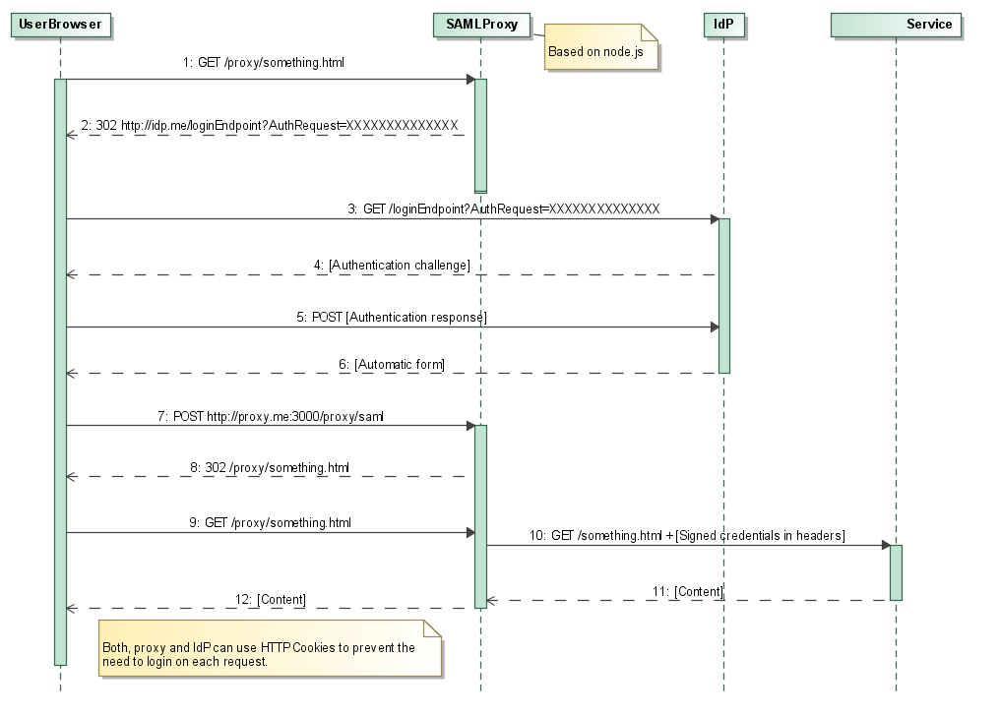

#saml2-proxy
---
A node.js-based proxy server that performs authentication using SAML2 protocol. Put between the service and identity provider, it follows the SAML2 protocol to authenticate user against the identity provider and passes user identity to the services in request header. 

The best effects can be achieved by combining with firewall configuration to prevent direct access to the service and signing user data using RSA-SHA1 algorithm.



It assumes, that implementing reading header values and signature checking is easy in the service. In fact that was the reason to write this proxy.

##Configuration

###Environment variables:
- **CONFIG_FILE** - full path (including file name) to configuration file that will be used instead of default proxy.json
- **NODE_ENV** - if you put `production` or simply `prod` here, verbose debug logging will be suppressed. It's recommended to do so when you're finished with development.
- **PORT** - start proxy on specified port. This overrides the port given in configuration file.

###Configuration file:
Below is the content of `proxy.example.json`. This file provides all possible options with comments. The default location of the actual configuration file is `${PROGRAM_DIR}/proxy.json` which has to be created by user based on the example:

```javascript

{
    // run proxy on this port. Default is 3000, can be overriden with PORT environment variable
    "port" : 3000,
    // protocol the proxy uses. Can be 'http' or 'https'
    "externalProtocol" : "https",
    // only required if externalProtocol === 'https'
    "ssl" : {
        // path to SSL private key file. Can be absolute or relative to certDir. PEM format, unencrypted.
        "privateKeyFile"    : "node_https_proxy/private_key.pem",
        // path to SSL certificate file. Can be absolute or relative to certDir. PEM format, unencrypted.
        "certificateFile"   : "node_https_proxy/cert.pem"
    },
    // name of HTTP header that will transport credentials
    "credentialsHeader" : "X-Auth-Credentials",
    // name of HTTP header that will transport credentials' signature
    "signatureHeader"    : "X-Auth-Signature",
    // path to private key file to be used to sign credentials. Can be absolute or relative to certDir. PEM format, unencrypted.
    // if not given, no signing will be performed
    "credentialsSigningKeyFile" : "privateKey.pem",
    // path to directory containing certificates and keys. Absolute or relative to application root.
    "certDir" : "cert",
    //settings for SAML authentication strategy
    "saml" : {
        // where to redirect user
        "entryPoint": "http://sso.local/simplesaml/saml2/idp/SSOService.php",
        // how do the proxy introduce itself to IdP
        "issuer": "E2ESSOWebTest",
        // in most cases should be equal to (externalProtocol + "://")
        "protocol": "https://",
        // certificate of IdP. PEM format without prolog and epilogue. If given, will be used to verify SAML response signature
        "cert": "MIICgTCCAeoCCQCbOlrWDdX7FTANBgkqhkiG9w0BAQUFADCBhDELMAkGA1UEBhMCTk8xGDAWBgNVBAgTD0FuZHJlYXMgU29sYmVyZzEMMAoGA1UEBxMDRm9vMRAwDgYDVQQKEwdVTklORVRUMRgwFgYDVQQDEw9mZWlkZS5lcmxhbmcubm8xITAfBgkqhkiG9w0BCQEWEmFuZHJlYXNAdW5pbmV0dC5ubzAeFw0wNzA2MTUxMjAxMzVaFw0wNzA4MTQxMjAxMzVaMIGEMQswCQYDVQQGEwJOTzEYMBYGA1UECBMPQW5kcmVhcyBTb2xiZXJnMQwwCgYDVQQHEwNGb28xEDAOBgNVBAoTB1VOSU5FVFQxGDAWBgNVBAMTD2ZlaWRlLmVybGFuZy5ubzEhMB8GCSqGSIb3DQEJARYSYW5kcmVhc0B1bmluZXR0Lm5vMIGfMA0GCSqGSIb3DQEBAQUAA4GNADCBiQKBgQDivbhR7P516x/S3BqKxupQe0LONoliupiBOesCO3SHbDrl3+q9IbfnfmE04rNuMcPsIxB161TdDpIesLCn7c8aPHISKOtPlAeTZSnb8QAu7aRjZq3+PbrP5uW3TcfCGPtKTytHOge/OlJbo078dVhXQ14d1EDwXJW1rRXuUt4C8QIDAQABMA0GCSqGSIb3DQEBBQUAA4GBACDVfp86HObqY+e8BUoWQ9+VMQx1ASDohBjwOsg2WykUqRXF+dLfcUH9dWR63CtZIKFDbStNomPnQz7nbK+onygwBspVEbnHuUihZq3ZUdmumQqCw4Uvs/1Uvq3orOo/WJVhTyvLgFVK2QarQ4/67OZfHd7R+POBXhophSMv1ZOo",
        // private key file used to sign SAML request. If given, must match a certificate registered in IdP.
        // Can be absolute path or relative to certDir
        "privateKeyFile": "privateKey.pem"
    },
    // In case the authentication takes longer than our session (see sessionDuration), we forget where to redirect user to
    // in that case this will be used as a safe default
    "indexPath" : "/proxy/ui/HelloWorldUI.html",
    // increase security by puttin some random characters here
    "sessionSecret" : "x&^RYg97c7dngw97dcg7&6T&^t967NC69WDQ0W89",
    // session duration in milliseconds. 0 means "browser session"
    "sessionDuration" : 300000,
    //define your routes here
    "routes": [
        {
            "routedPrefix": "/proxy",
            "destination": "services.local",
            "destinationPort": 13333
        }
    ]
}

```
---
